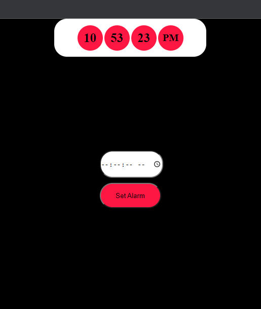
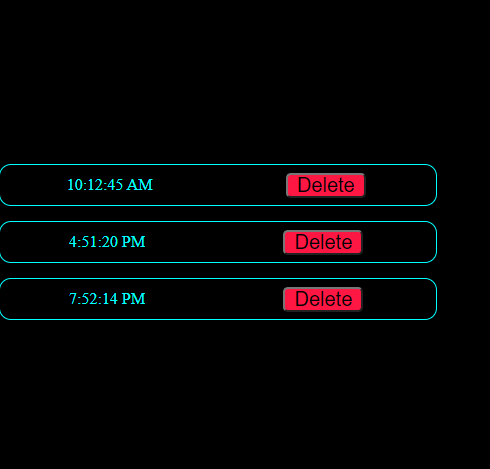

# Alarm Clock
## The digital Alarm Clock

Digital Alarm Clock implemented using

- HTML
- CSS
- Vanilla Javascript
## Features

- Display current time
- Add alarm
- Delete Alarm
- Notify when alarm goes off.

## Images

## Demo
You can check the app out [Alarm Clock](https://alarm-clock-1.mahtab04.repl.co/).

